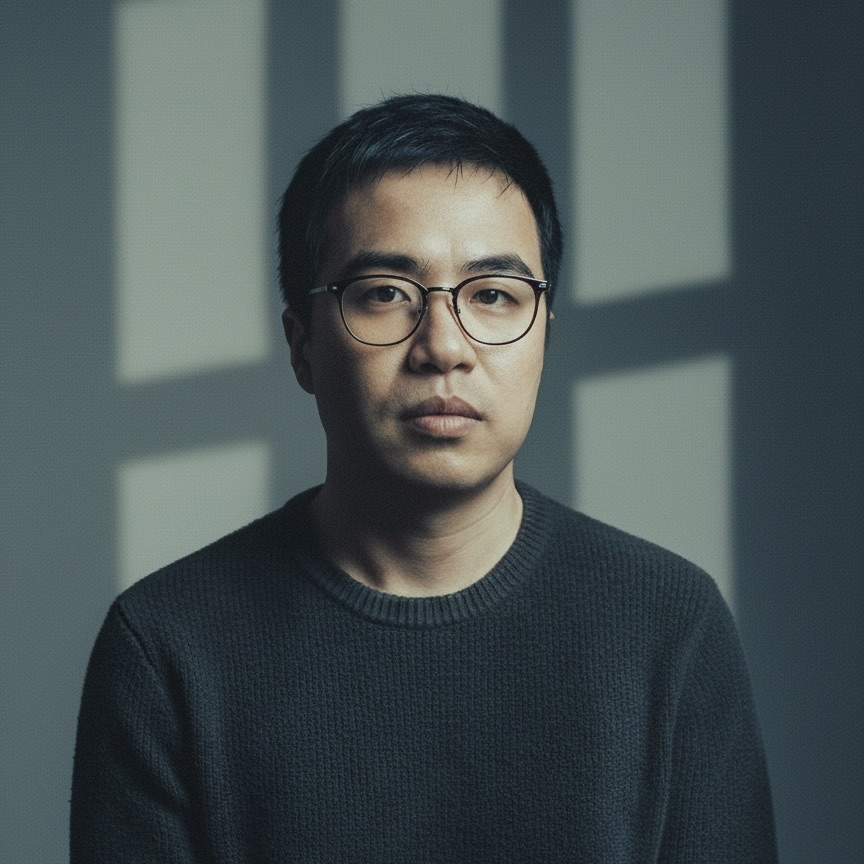
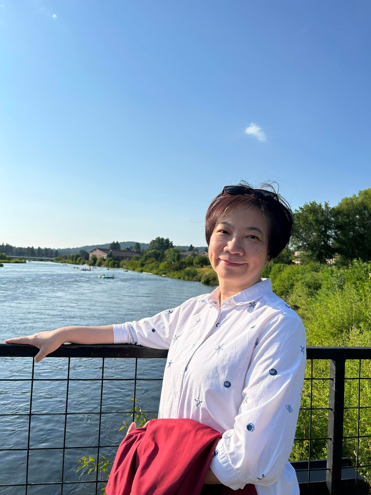

# 中華AI應用發展協會 CAIADA

Chinese AI Application Development Association

中華AI應用發展協會（CAIADA）為依法設立、非以營利為目的之公益性社會團體，致力於連結學術界、產業界、政府部門與專業社群，推動人工智慧技術發展、產業應用與人才培育。

## 使命與願景

本會以促進人工智慧技術發展與產業應用為核心，推動智慧化社會永續成長，建立跨領域、跨產業、跨區域的 AI 應用交流平台。

我們期望透過產業交流、資源整合、商務對接與生態共建，協助會員掌握 AI 技術趨勢、拓展合作機會，並促進 AI 應用在教育、產業、公共服務與社會創新等領域落地。

## 宗旨與任務

**宗旨：促進人工智慧技術發展與產業應用，推動智慧化社會永續成長。**

本會依相關法令規定推動及執行下列任務：

1. 人工智慧核心技術研發與跨域應用推廣。
2. 國際 AI 技術交流與產業合作促進。
3. AI 應用導向期刊出版與產業知識共享。
4. AI 技術人才培育與教育推廣。
5. 政府 AI 政策建言與產業白皮書編纂。
6. 縮減城鄉、世代 AI 數位落差計畫推動與執行。
7. 會員權益保障及產業資訊整合平台營運。
8. AI 技術競賽與人才發掘體系。

## 協會架構

本會由會長與副會長共同推動協會發展方向、會員服務、產業合作與對外交流。

  <!-- 會長卡片 -->
  

    

      
    

    <h3 class="text-2xl font-extrabold text-neutral-800 dark:text-neutral-100 mb-1 tracking-tight">蔣濤</h3>
    會長
    

      復旦大學人工智能博士。長期致力於人工智慧前沿技術研究，推動產業應用落地與跨領域合作。
    

  

  <!-- 副會長 許惠堯 -->
  

    

      
    

    <h3 class="text-2xl font-extrabold text-neutral-800 dark:text-neutral-100 mb-1 tracking-tight">許惠堯</h3>
    副會長
    

      國立陽明交通大學公共衛生研究所碩士，中國醫藥大學公共衛生學系學士。長期關注公共衛生與大健康產業，推動人工智慧技術與公共健康領域的融合應用。
    

  

  <!-- 副會長 姚蘊慧 -->
  

    

      
    

    <h3 class="text-2xl font-extrabold text-neutral-800 dark:text-neutral-100 mb-1 tracking-tight">姚蘊慧</h3>
    副會長
    

      中國文化大學國家發展與中國大陸研究所副教授。學術專長為比較社會政策與社會運動，致力於探討人工智慧在社會發展中的倫理治理與應用政策。
    

  

