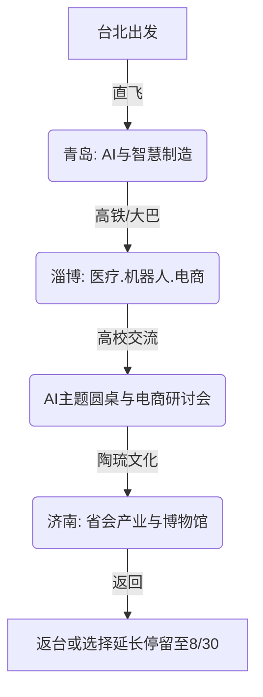

## 🚀 2026山东 AI 产业参访交流活动 —— 智启山东，青年同行

为了带领台湾青年学生与企业主深度对接大陆前沿科技、智慧制造与电商产业，**中华 AI 应用发展协会**特别筹办 **「2026山东 AI 产业参访交流活动」**。

本次活动定位为 **「青年学生为主、企业主为辅」** 的产业深度学习与文化体验之旅。我们将走访 **青岛、淄博、济南** 三大核心城市，深入医疗健康、智慧工厂、前沿 AI 算法以及蓬勃发展的电商巨头，并与当地高校举办 AI 主题圆桌论坛！

---

## 📅 活动核心设定

*   **正式行程日期**：2026 年 8 月 16 日 (日) 至 2026 年 8 月 22 日 (六) (7 天 6 晚)
*   **请假攻略**：团员主要请假日为 2026-08-17 (一) 至 2026-08-21 (五)，仅需请假 **5 个工作日**！
*   **特别福利（延长停留政策）**：为了支持有深度考察或自主交流意愿的团员，**山东接待方特提供落地支援延期政策，最晚可延长停留至 2026 年 8 月 30 日 (日)**！8/23 - 8/30 延长停留期间，接待方仍将提供在地的落地支援（交通与住宿等细节将依实际登记人数后续协调确认）。
*   **活动费用**：预估约 **19,000 元新台币** (主要包含台北-青岛往返机票、保险及行政作业费用)。
*   **超级福利**：**山东省内的交通、住宿、餐饮、参访接待、场馆门票等，均由山东接待方全额覆盖！** 团员享极高性价比的落地全包接待。

---

## 🌟 行程亮点与主轴安排

本次行程针对青年学生的成长需求与企业主的对接需求进行了深度优化，兼顾科技前沿与文化底蕴：

### 1. 📍 青岛：AI 创新与城市产业 (8/16 ~ 8/18)
*   **科技参访**：考察青岛知名 AI 科技园区、智慧制造龙头企业，深入了解数字经济在大湾区的实践。
*   **人文体验**：走访**青岛啤酒博物馆**、五四广场、奥帆中心，感受这座海滨城市的独特魅力与工业文化历史。

### 2. 📍 淄博：智慧健康、机器人与电商研讨 (8/18 ~ 8/21)
*   **产业对接**：深入参访淄博代表性的医疗器械、智慧健康、智慧机器人与先进智能制造企业。
*   **高校交流**：于山东知名高校举办 **「AI主题圆桌交流会」** 与 **「电商运营研讨会」**，共同研讨两岸产业差异、青年创业痛点以及 AI 工具的实务落地应用。
*   **文化陶琉**：参观**中国陶瓷琉璃馆**、琉璃文化创意园，亲身体验名扬海内外的淄博陶琉国宝级工艺。

### 3. 📍 济南：省会产业与文化收束 (8/21 ~ 8/22)
*   **文化探访**：走访**山东省博物馆**、大明湖等标志性景点，深度体验齐鲁大地的深厚文化底蕴。
*   **行程返程**：8/22 于济南完成行程收束，搭乘专车前往青岛胶东机场返回台北。

---

## 📋 报名信息

本活动名额有限，优先面向 **20岁～45岁设籍台湾之青年学生、青年创业者及企业主** 开放报名。

> ### 🛑 立即启动您的 AI 探索之旅！
> 👉 **[点此进入 Google 表单进行报名](https://docs.google.com/forms/d/e/1FAIpQLSf1cN8hJ90gfMb6IsgjbO8anFQAtHSkV3eg1ubtGakgolcnRA/viewform)**
>
> *   **注意事项**：填表时需准备 1 张半身证件照电子档（档名请设为「姓名-出生年月日8位数」，例如：陈高雄20001010）及护照、台胞证照片上传。台胞证若办理中可先选择「后补」并照常提交表单。
> *   有任何特殊航班或延长停留需求，请务必在表单中注明，行政团队将第一时间与您联系。

---

> [!NOTE]
> 主办单位：中华 AI 应用发展协会
> 协办与落地接待单位：山东省各市接待单位
> 本行程可能根据接待方实际预约与航班情况进行适度微调，最终行程以行前说明会公佈为准。
