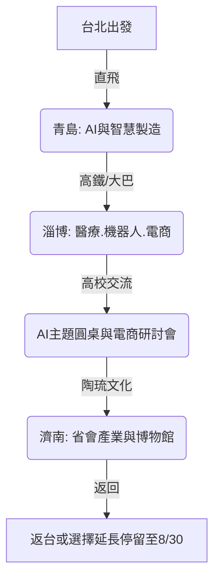

## 2026山東 AI 產業參訪交流活動 —— 智啟山東，青年同行

為了帶領台灣青年學生與企業主深度對接大陸前沿科技、智慧製造與電商產業，**中華 AI 應用發展協會**特別籌辦 **「2026山東 AI 產業參訪交流活動」**。

本次活動定位為 **「青年學生為主、企業主為輔」** 的產業深度學習與文化體驗之旅。我們將走訪 **青島、淄博、濟南** 三大核心城市，深入醫療健康、智慧工廠、前沿 AI 算法以及蓬勃發展的電商巨頭，並與當地高校舉辦 AI 主題圓桌論壇！

---

## 活動核心設定

*   **正式行程日期**：2026 年 8 月 16 日 (日) 至 2026 年 8 月 22 日 (六) (7 天 6 晚)
*   **請假攻略**：團員主要請假日為 2026-08-17 (一) 至 2026-08-21 (五)，僅需請假 **5 個工作日**！
*   **特別福利（延長停留政策）**：為了支持有深度考察或自主交流意願的團員，**山東接待方特提供落地支援延期政策，最晚可延長停留至 2026 年 8 月 30 日 (日)**！8/23 - 8/30 延長停留期間，接待方仍將提供在地的落地支援（交通與住宿等細節將依實際登記人數後續協調確認）。
*   **活動費用**：預估約 **19,000 元台幣** (主要包含台北-青島往返機票、保險及行政作業費用)。
*   **超級福利**：**山東省內的交通、住宿、餐飲、參訪接待、場館門票等，均由山東接待方全額覆蓋！** 團員享極高性價比的落地全包接待。

---

## 行程亮點與主軸安排

本次行程針對青年學生的成長需求與企業主的對接需求進行了深度優化，兼顧科技前沿與文化底蘊：

### 1. 青島：AI 創新與城市產業 (8/16 ~ 8/18)
*   **科技參訪**：考察青島知名 AI 科技園區、智慧製造龍頭企業，深入了解數字經濟在大灣區的實踐。
*   **人文體驗**：走訪**青島啤酒博物館**、五四廣場、奧帆中心，感受這座海濱城市的獨特魅力與工業文化歷史。

### 2. 淄博：智慧健康、機器人與電商研討 (8/18 ~ 8/21)
*   **產業對接**：深入參訪淄博代表性的醫療器械、智慧健康、智慧機器人與先進智能製造企業。
*   **高校交流**：於山東知名高校舉辦 **「AI主題圓桌交流會」** 與 **「電商運營研討會」**，共同研討兩岸產業差異、青年創業痛點以及 AI 工具的實務落地應用。
*   **文化陶琉**：參觀**中國陶瓷琉璃館**、琉璃文化創意園，親身體驗名揚海內外的淄博陶琉國寶級工藝。

### 3. 濟南：省會產業與文化收束 (8/21 ~ 8/22)
*   **文化探訪**：走訪**山東省博物館**、大明湖等標誌性景點，深度體驗齊魯大地的深厚文化底蘊。
*   **行程返程**：8/22 於濟南完成行程收束，搭乘專車前往青島膠東機場返回台北。

---

## 報名資訊

本活動名額有限，優先面向 **20歲～45歲設籍台灣之青年學生、青年創業者及企業主** 開放報名。

> ### 立即啟動您的 AI 探索之旅！
> **[點此進入 Google 表單進行報名](https://docs.google.com/forms/d/e/1FAIpQLSf1cN8hJ90gfMb6IsgjbO8anFQAtHSkV3eg1ubtGakgolcnRA/viewform)**
>
> *   **注意事項**：填表時需準備 1 張半身證件照電子檔（檔名請設為「姓名-出生年月日8位數」，例如：陳高雄20001010）及護照、台胞證照片上傳。台胞證若辦理中可先選擇「後補」並照常提交表單。
> *   有任何特殊航班或延長停留需求，請務必在表單中註明，行政團隊將第一時間與您聯繫。

---

> [!NOTE]
> 主辦單位：中華 AI 應用發展協會
> 協辦與落地接待單位：山東省各市接待單位
> 本行程可能根據接待方實際預約與航班情況進行適度微調，最終行程以行前說明會公佈為準。
